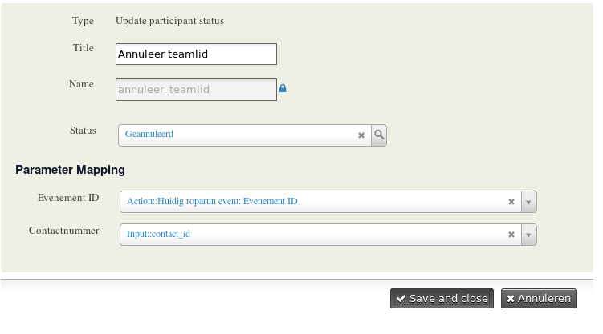

# Howto create a update participant status action

In this tutorial I will explain how you could develop an action which does update an existing participant record.
It is also possible to create an action in [your own extension](howto_create_an_action_in_an_extension.md) but that would be dealt with in another tutorial.

## Contents

* [Required functionality](#required-functionality)
* [Create an action class](#create-an-action-class)
  * [Create the class](#create-the-class)
  * [Specify the configuration options](#specify-the-configuration-options)
  * [Specify the parameter options](#specify-the-parameter-options)
  * [Specify the output of the action](#specify-the-output-of-the-action)
  * [The actual action](#the-actual-action)
  * [Add a tag to this action](#add-a-tag-to-this-action)
* [Make it available to the action provider](#make-it-available-to-the-action-provider)

## Required functionality

The action should update an existing participant record.
Based on the provided event_id and contact_id the participant record is updated to the status configured by the site administrator.

In _action-provider_ terminology this means we need _status_ as a _configuration option_ and _event_id_ and _contact_id_ as _parameter options_.

The action would not return anything.



## Create an action class

Start with a file in the directory _Civi\ActionProvider\Actions\Event\UpdateParticipantStatus.php_
This file will contain the action class which is extended from the abstract action.

### Create the class

```php

  <?php

  namespace Civi\ActionProvider\Action\Event;

  use \Civi\ActionProvider\Action\AbstractAction;
  use \Civi\ActionProvider\Parameter\ParameterBagInterface;
  use \Civi\ActionProvider\Parameter\SpecificationBag;
  use \Civi\ActionProvider\Parameter\Specification;

  use CRM_ActionProvider_ExtensionUtil as E;

  class UpdateParticipantStatus extends AbstractAction {
  }

```

Above code will create the class, every action has to extend the _AbstractAction_ class. As you can see we use namespace and use statements.
The use statement are required for the next step and are a kind of _include_ or _require_ statement.

### Specify the configuration options

In this step we define the configuration option of the action. A configuration option is something which should be set by the
site administrator.

We do this by returning a _specification bag_ in which all configuration fields are specified.

In our case we have only one configuration option and that is the new status.

```php

  class UpdateParticipantStatus extends AbstractAction {

    //...

    /**
     * Returns the specification of the configuration options for the actual action.
     *
     * @return SpecificationBag
     */
    public function getConfigurationSpecification() {
      return new SpecificationBag(array(
        /**
         * The parameters given to the Specification object are:
         * @param string $name
         * @param string $dataType
         * @param string $title
         * @param bool $required
         * @param mixed $defaultValue
         * @param string|null $fkEntity
         * @param array $options
         * @param bool $multiple
         */
        new Specification('status', 'Integer', E::ts('Status'), true, null, 'ParticipantStatusType', null, FALSE),
      ));
    }

  }

```

In the code above we define a field which has the name _status_ an Integer Type, the human title is a translated string, it is a reuiqred option, no default value, and the list of options are retrieved from the _ParticipantStatus_ entity.

### Specify the parameter options

In this step we specify which parameters the action has. This is similair to the configuration specification.
The difference between a parameter and a configuration is that a configuration is set by a site administrator
whilst a parameter is coming from an other action, an input etc. Depending on the situation in which the action is used
e.g. when used in the [form-processor](https://lab.civicrm.org/extensions/form-processor) a parameter could be mapped to an input of a
form processor or to an output of previous action.

In our specific example we have the event_id and the contact_id as parameters.

```php

  class UpdateParticipantStatus extends AbstractAction {

    //...

    /**
     * Returns the specification of the configuration options for the actual action.
     *
     * @return SpecificationBag
     */
    public function getParameterSpecification() {
      return new SpecificationBag(array(
        /**
         * The parameters given to the Specification object are:
         * @param string $name
         * @param string $dataType
         * @param string $title
         * @param bool $required
         * @param mixed $defaultValue
         * @param string|null $fkEntity
         * @param array $options
         * @param bool $multiple
         */
        new Specification('event_id', 'Integer', E::ts('Event ID'), true, null, null, null, FALSE),
        new Specification('contact_id', 'Integer', E::ts('Contact ID'), true, null, null, null, FALSE),
      ));
    }

  }

```

### Specify the output of the action

In this step we specify which fields an action outputs.
This is similair to the specification of configuration and parameters.
In this particilair example we dont output anything.

```php

  class UpdateParticipantStatus extends AbstractAction {

    //...

    /**
     * Returns the specification of the output parameters of this action.
     *
     * This function could be overridden by child classes.
     *
     * @return SpecificationBag
     */
    public function getOutputSpecification() {
      return new SpecificationBag();
    }

  }

```

### The actual action

In this step the actual action is developed. So what we have to do here is to look up
a participant record for certain event and contact and set the status to configured status.

The first thing which is important here is to note that the action-provider does validate the incoming parameters and configuration
options. So we can assume those are valid.

Also note that we throw an Exception when no participant record could be found.

```php

  class UpdateParticipantStatus extends AbstractAction {

    // ...

    /**
     * Run the action
     *
     * @param ParameterInterface $parameters
     *   The parameters to this action.
     * @param ParameterBagInterface $output
     *   The parameters this action can send back
     * @return void
     */
    protected function doAction(ParameterBagInterface $parameters, ParameterBagInterface $output) {
      // Get the contact and the event.
      $contact_id = $parameters->getParameter('contact_id');
      $event_id = $parameters->getParameter('event_id');

      // Find the participant record for this contact and event.
      // This assumes that the contact has already been registered for the event.
      $participant = civicrm_api3('Participant', 'get', array(
        'contact_id' => $contact_id,
        'event_id' => $event_id,
        'options' => array('limit' => 1),
      ));
      if ($participant['count'] < 1) {
        // No record is found.
        throw new \Civi\ActionProvider\Action\Exception\ExecutionException(E::ts('Could not find a participant record'));
      }

      // Get the participant record and the status id from the configuration.
      $participant = reset($participant['values']);
      $new_status_id = $this->configuration->getParameter('status');

      // Update the participant record through an API call.
      try {
        civicrm_api3('Participant', 'create', array(
          'id' => $participant['id'],
          'status_id' => $new_status_id,
        ));
      } catch (Exception $e) {
        throw new \Civi\ActionProvider\Action\Exception\ExecutionException(E::ts('Could not update participant status'));
      }
    }
  }

```

## Make it available to the action provider

Now we have defined our action class. The last thing we have to do is to make it known to the action provider.

What we have to do to is to add our class to the action provider class in _Civi\ActionProvider\Provider.php_:

When we do that we give our action a name, a title and we provide some tags for the action.

```php

  namespace Civi\ActionProvider;
  // ...

  class Provider {

    // ...

    public function __construct() {
      // ..
      $this->addAction('UpdateParticipantStatus', '\Civi\ActionProvider\Action\Event\UpdateParticipantStatus', E::ts('Update participant status'), array(
        AbstractAction::SINGLE_CONTACT_ACTION,
        AbstractAction::DATA_MANIPULATION
      ));
      // ...
    }

    // ...

  }

```

The only thing we do is add our action to the constructor.
If you implement actions in [your own extension](howto_create_an_action_in_an_extension.md) this would be done in a different way.
